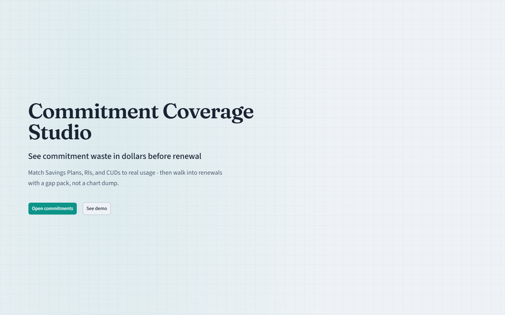
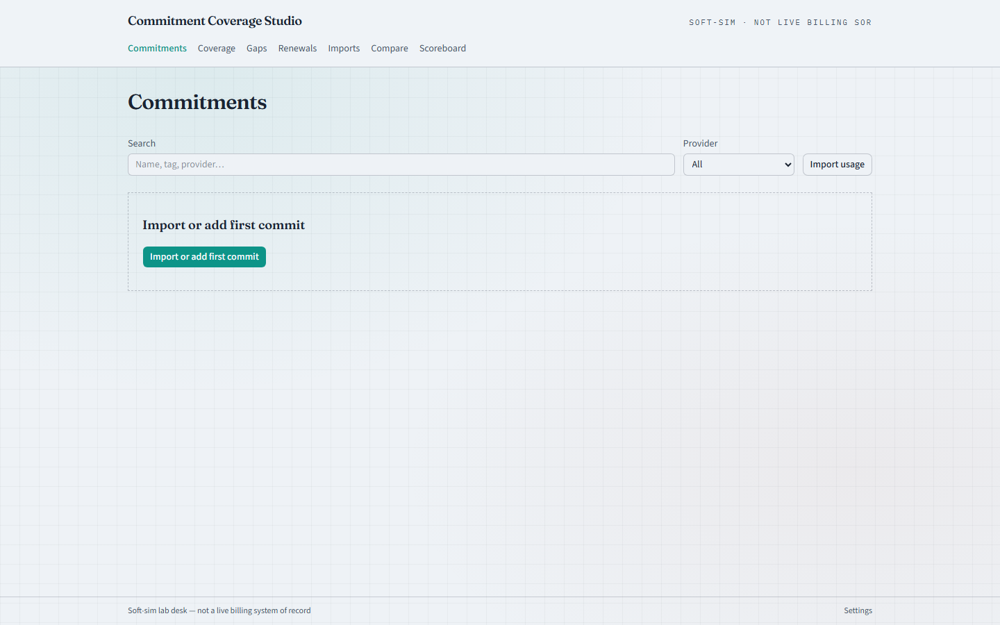
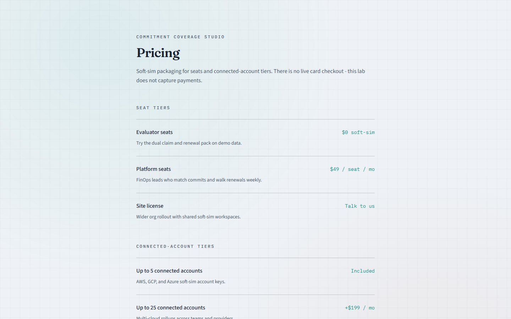
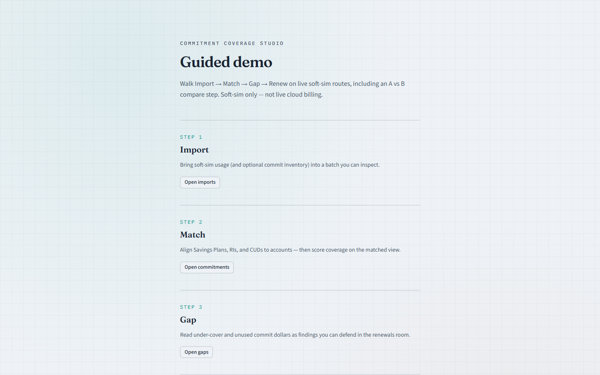
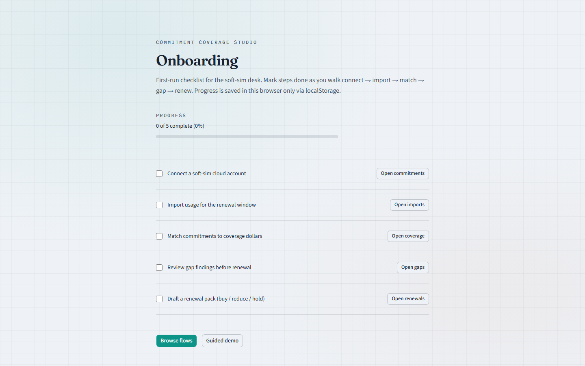

# Commitment Coverage Studio

See commitment waste in dollars before renewal.

Soft-sim FinOps desk that imports multi-cloud commitment inventory and usage, scores under-coverage and unused commit in dollars, and compares **commit-matched (A)** vs **on-demand-blind (B)** so renewals open with a gap pack - not a chart museum.

## Screenshots

### Landing



### Commitments



### Pricing



### Demo



### Onboarding



## Run locally

```bash
cd projects/commitment-coverage-studio
npm install
npm run dev
```

Open [http://localhost:3000](http://localhost:3000). Demo bearer token: `ccs-demo-token`.

```bash
npm test
npm run build
npm start
```

## Honesty

This is a method-lab soft-sim. It is not a live billing system of record, does not purchase commitments, and does not connect to production cloud consoles.

Offline dual-claim digest: open [`try.html`](./try.html) or `/try.html` from the running app (Honesty / Demo).

## Primary routes

| Route | Job |
|-------|-----|
| `/` | Marketing landing |
| `/commitments` | Commitment inventory |
| `/imports` | Usage / inventory import |
| `/coverage` | Commit-matched coverage |
| `/gaps` | Dollar gap findings |
| `/compare` | A vs B claim |
| `/renewals` | Renewal packs |
| `/scoreboard` | Org scoreboard |
| `/pricing` | Soft-sim plans |
| `/demo` | Guided walkthrough |
| `/onboarding` | Checklist |
| `/flows` | Journey index |
| `/honesty` | Soft-sim fence |
| `/settings` | Org, members, audit |
