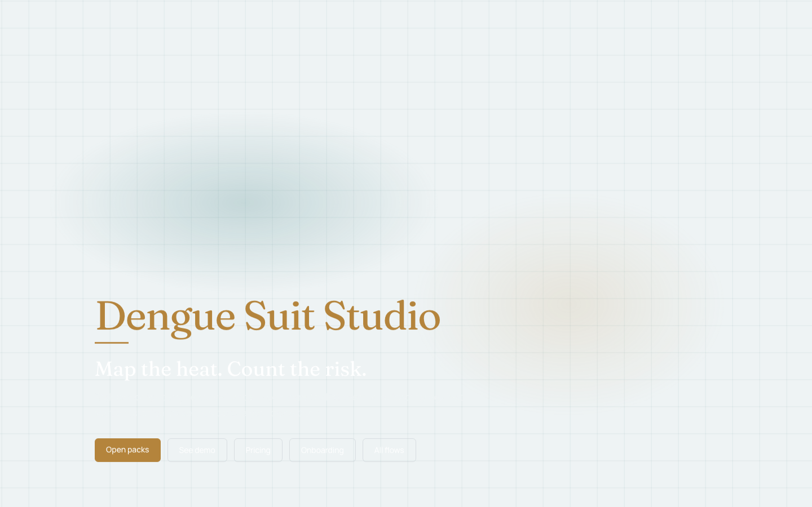
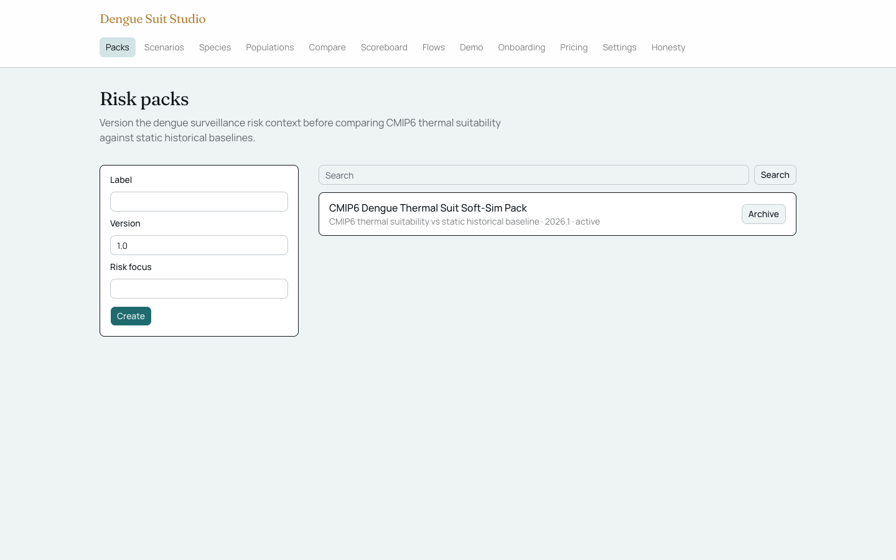
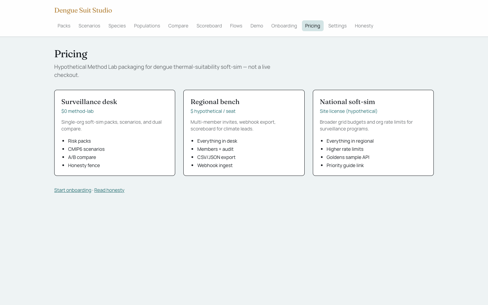
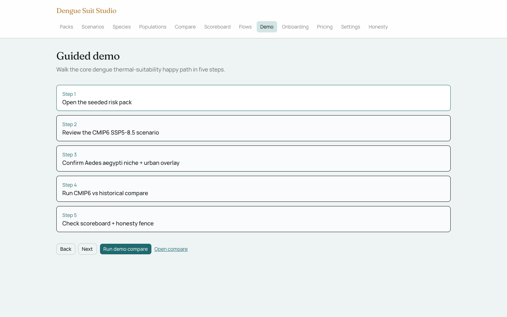
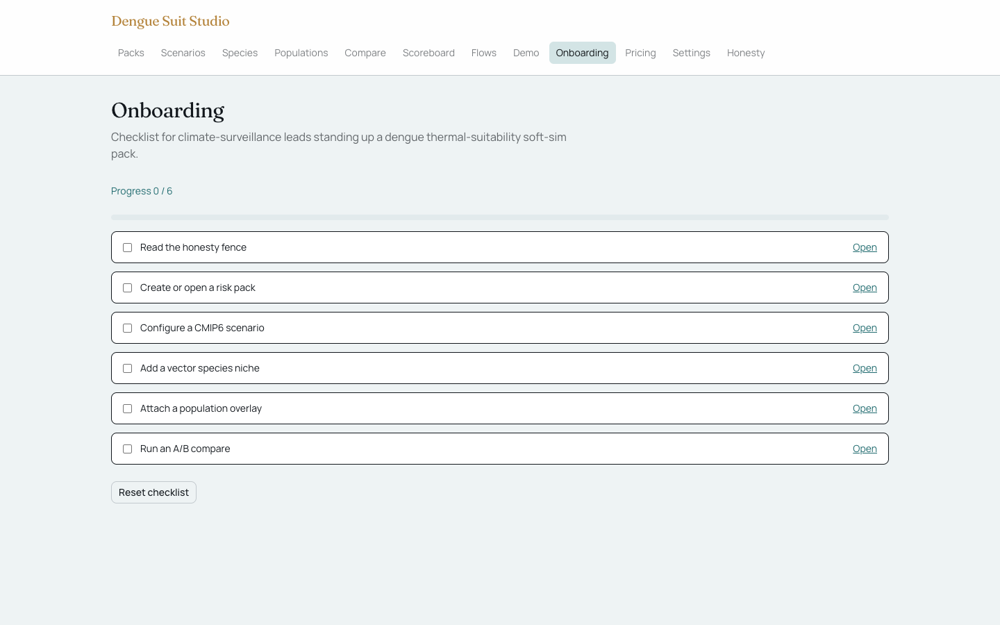
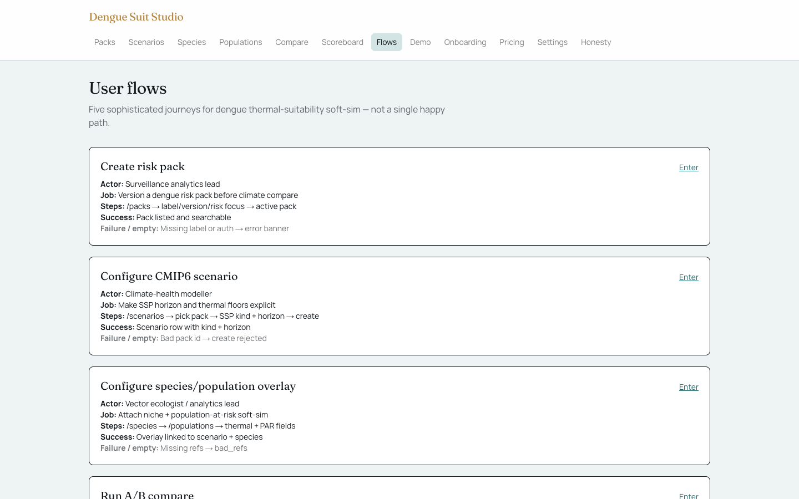

# Dengue Suit Studio

Soft-sim studio for public-health / climate-surveillance analytics leads who need to compare **CMIP6 thermal-suitability** dengue risk maps against **static historical baselines** before locking a surveillance pack.

## Screenshots

### Landing



### Primary workspace



### Pricing



### Demo



### Onboarding



### Flows



## Run

```bash
cd projects/dengue-suit-studio
npm install
npm run dev
```

Open http://localhost:3000

## Tests

```bash
npm test
npm run test:app-up
```

## Honesty

Not live outbreak prediction. Not clinical diagnosis. Not operational mosquito control deployment. Not the authors' dengue atlas.

Paper: https://www.medrxiv.org/content/10.64898/2026.07.02.26357126v2
